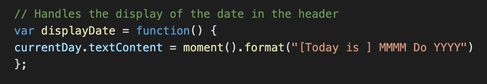
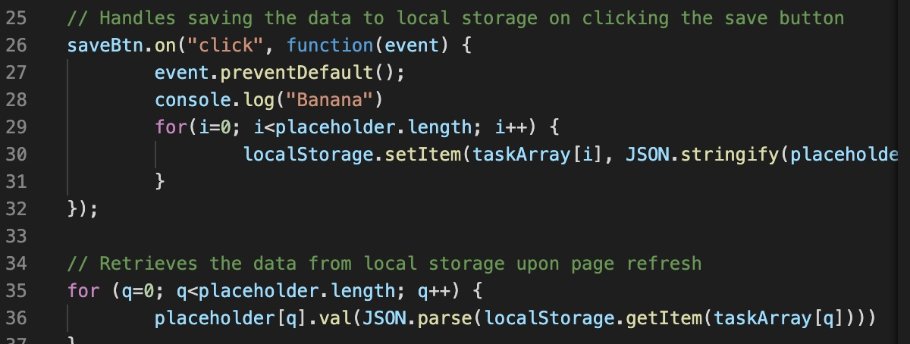
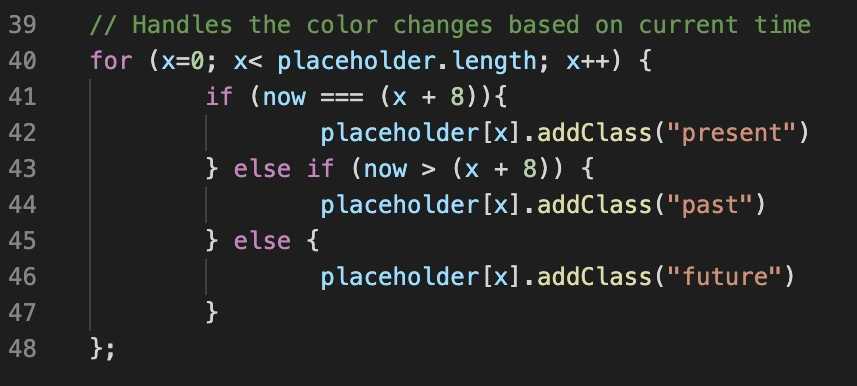
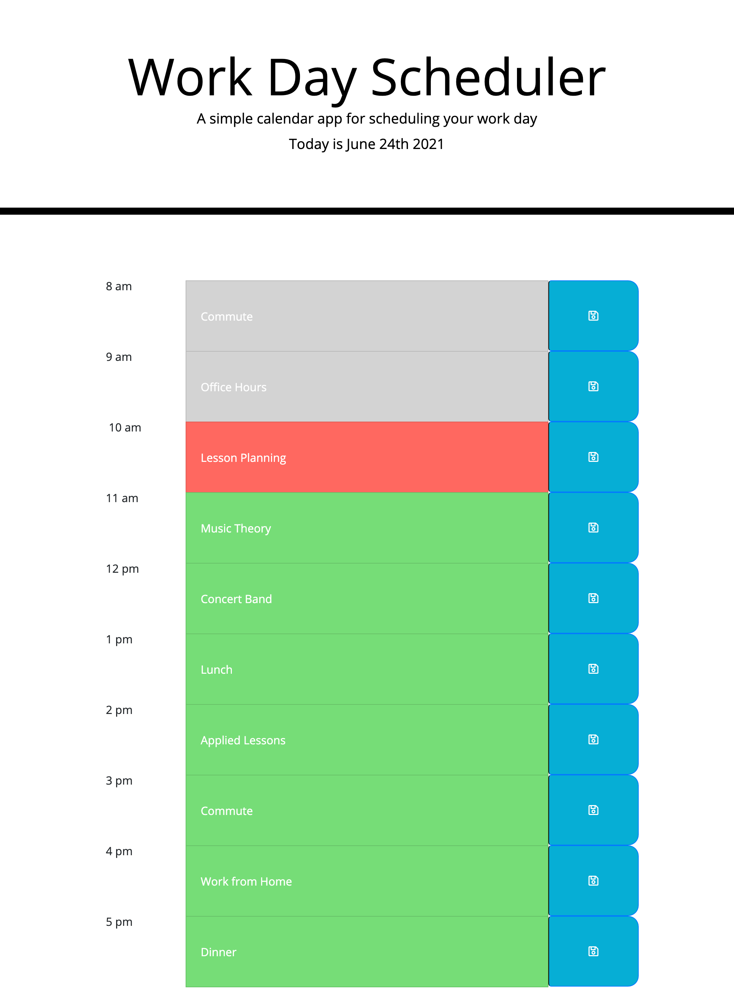

# sdp-day-planner

Description: This is a day planner that will allow you schedule your work day by the hour with tasks. The tasks then are saved to local storage and stay in their blocks upon refresh. The blocks are input boxes and can be filled in easily. They also dynamically change color based on the time of day.

How to use: Click in the textbox to fill in the desired task for that hour. Then click the save button to save the task in local storage.

Code snippets: The date dynamically updates in the header of the website using this code: 

These for loops send and retrieve the data to/from local storage:

Finally the input boxes dynamically change color based on the time of day using this for loop:

Full Screenshot:

Contact Info: scotty.d.phillips@gmail.com